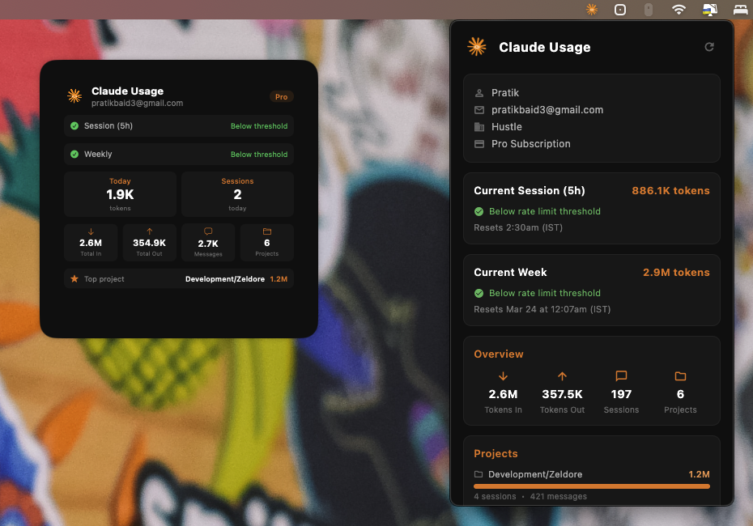

# Claude Usage Tracker

A macOS menu bar app + desktop widget that tracks your [Claude Code](https://docs.anthropic.com/en/docs/claude-code) usage — tokens consumed, sessions, projects, and rate limit status — all at a glance.


## Download

[](https://drive.google.com/file/d/1gcRMVgBk5VTTF1AzOyM7fNo7KKSOkb4A/view?usp=drive_link)

> Open the DMG, drag **ClaudeUsageTracker** to Applications, then launch it. Right-click desktop > Edit Widgets > search "Claude" to add the desktop widget.

> **Note:** The desktop widget requires the app to be signed with a matching Apple Developer identity. If the widget doesn't appear, you'll need to build from source with your own signing identity (see [Setup](#setup) below).

## Features

**Menu Bar App**
- Lives in your macOS menu bar — no dock icon, no clutter
- Shows account info, plan type, and organization
- Tracks token usage (input + output + cache creation) per session and per week
- Displays rate limit status with percentage bar when usage is critical
- Per-project token breakdown with session and message counts
- Recent prompt history
- Auto-refreshes every 2 minutes

**Desktop Widget (Large)**
- Native macOS WidgetKit widget for your desktop
- Today's token usage and session count
- All-time stats: tokens in/out, messages, projects
- Top project by token usage
- Rate limit status with green/orange/red indicators
- Refreshes every 15 minutes

## Screenshot



## How It Works

The app reads data from Claude Code's local files:

- `~/.claude.json` — account info (name, email, plan)
- `~/.claude/projects/` — session JSONL files with per-message token counts
- `~/.claude/history.jsonl` — recent prompt history
- Claude CLI (`~/.local/bin/claude`) — rate limit data from API response headers

The menu bar UI is built with **Flutter**, while the status bar icon, window management, and widget data pipeline use **native Swift**. The desktop widget is a pure **SwiftUI WidgetKit** extension.

Data flows from the main app to the widget via a shared **App Group** (`UserDefaults` with a shared suite name).

## Prerequisites

- macOS 14.0+
- [Flutter SDK](https://docs.flutter.dev/get-started/install/macos) (3.41+)
- Xcode 16+
- [Claude Code](https://docs.anthropic.com/en/docs/claude-code) installed and signed in
- An Apple Developer account (for code signing the widget)

## Setup

### 1. Clone and install dependencies

```bash
git clone https://github.com/yourusername/claude-usage-tracker.git
cd claude-usage-tracker
flutter pub get
cd macos && pod install && cd ..
```

### 2. Configure signing

Open `macos/Runner.xcworkspace` in Xcode:

1. Select the **Runner** target > Signing & Capabilities > set your Team
2. Select the **ClaudeUsageWidget** target > Signing & Capabilities > set your Team
3. Add **App Groups** capability to both targets with the same group ID (e.g., `TEAM_ID.claudeUsageTracker`)

### 3. Update App Group ID

Replace the App Group identifier in these files with your own Team ID:

- `macos/Runner/AppDelegate.swift` — look for `UserDefaults(suiteName: "...")`
- `macos/ClaudeUsageWidget/ClaudeUsageWidget.swift` — same line
- `macos/Runner/DebugProfile.entitlements`
- `macos/Runner/Release.entitlements`
- `macos/ClaudeUsageWidget/ClaudeUsageWidget.entitlements`
- `macos/ClaudeUsageWidgetExtension.entitlements`

### 4. Update home directory

The app currently uses a hardcoded home path in a few places. Search for `/Users/pratikbaid` and replace with your username or use dynamic resolution.

### 5. Build and run

```bash
# Development (menu bar app only)
flutter run -d macos

# Production build with widget
flutter build macos

# Build DMG for distribution
./scripts/build_dmg.sh
```

The DMG will be created at `build/ClaudeUsageTracker.dmg`. Open it and drag the app to Applications.

### 6. Install with widget support (manual)

The desktop widget requires the app to be installed in `/Applications` with proper code signing:

```bash
# Build
flutter build macos

# Install
cp -R build/macos/Build/Products/Release/claude_usage_tracker.app /Applications/ClaudeUsageTracker.app

# Sign with entitlements (replace IDENTITY with your signing identity)
IDENTITY="Apple Development: Your Name (XXXXXXXXXX)"
PROJ="macos"

codesign --force --sign "$IDENTITY" \
  --entitlements "$PROJ/ClaudeUsageWidget/ClaudeUsageWidget.entitlements" \
  /Applications/ClaudeUsageTracker.app/Contents/PlugIns/ClaudeUsageWidgetExtension.appex

codesign --force --sign "$IDENTITY" \
  --entitlements "$PROJ/Runner/Release.entitlements" \
  /Applications/ClaudeUsageTracker.app

# Register and launch
lsregister -f /Applications/ClaudeUsageTracker.app
open /Applications/ClaudeUsageTracker.app
```

Then right-click your desktop > **Edit Widgets** > search for **"Claude"** to add the widget.

## Project Structure

```
lib/
  main.dart                  # Flutter UI — menu bar dashboard

macos/
  Runner/
    AppDelegate.swift         # Status bar icon, window management, widget data writer
    MainFlutterWindow.swift   # Flutter window setup
    Info.plist                # LSUIElement (hides dock icon)

  ClaudeUsageWidget/
    ClaudeUsageWidget.swift   # WidgetKit widget (SwiftUI)
    Assets.xcassets/          # Widget icon assets

  ClaudeUsageWidgetBundle.swift  # Widget entry point

assets/
  app_icon.png               # App icon
```

## Architecture

```
┌─────────────────────────────────────────────┐
│  ~/.claude.json + ~/.claude/projects/       │
│  (Claude Code local data)                   │
└──────────────┬──────────────────────────────┘
               │ reads
               v
┌──────────────────────────┐     UserDefaults
│  AppDelegate.swift       │──(App Group)──┐
│  (native Swift, no sandbox)              │
│  - reads claude data                     │
│  - writes to shared defaults             │
│  - runs CLI for rate limits              │
└──────────────────────────┘               │
               │                           v
               │ hosts              ┌──────────────────┐
               v                    │  WidgetKit        │
┌──────────────────────────┐  │  (SwiftUI, sandboxed) │
│  Flutter UI              │  │  - reads shared defaults│
│  (menu bar dashboard)    │  │  - displays stats       │
│  - account info          │  └──────────────────────┘
│  - token usage bars      │
│  - project breakdown     │
│  - recent activity       │
└──────────────────────────┘
```

## Customization

**Change accent color:** Edit the color constants at the top of `lib/main.dart`:
```dart
const Color claudeOrange = Color(0xFFE8792E);
const Color claudeBg = Color(0xFF0D0D0D);
```

**Change widget refresh interval:** In `ClaudeUsageWidget.swift`, modify the timeline policy:
```swift
let nextUpdate = Calendar.current.date(byAdding: .minute, value: 15, to: Date())!
```

**Token counting:** The app counts `input_tokens + cache_creation_input_tokens + output_tokens`. Cache read tokens are excluded as they're heavily discounted and don't reflect actual usage.

## Known Limitations

- Rate limit percentages only appear when usage exceeds the warning threshold (~80%). Below that, the API doesn't return utilization data.
- The desktop widget requires proper code signing with `--entitlements` flag — without it, the App Group entitlements are stripped and the widget can't read shared data.
- Widget data updates when the menu bar app writes it (every 2 min). The widget itself refreshes its display every 15 min.
- The app reads Claude Code's local files directly. If Claude Code changes its file format, the parser may need updating.

## Contributing

Contributions are welcome! Some ideas:

- [ ] Dynamic home directory resolution (remove hardcoded path)
- [ ] Cost estimation based on token counts and model pricing
- [ ] Historical usage graphs
- [ ] Multiple account support
- [ ] Auto-start on login
- [ ] Medium and small widget sizes
- [ ] Notification when rate limit is approaching

## License

MIT
